#Task Sheet 1 - Validation Improvements

##Introduction
This series of tasks focuses on validation i.e. ensuring that the values entered by the user are correct and that the interface of the program is user friendly.

##Task 1 - Improving the Sample Message Input
When you first run the program you are presented with the option of running the **sample game** or starting a **new game**:

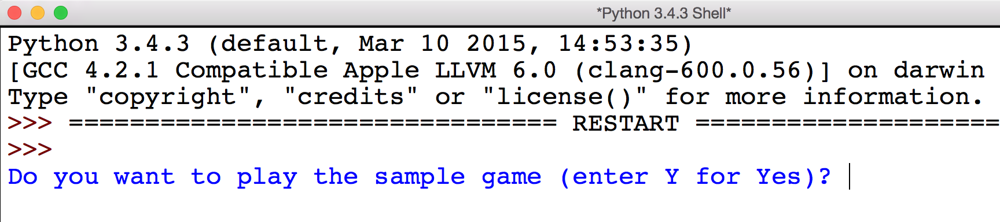

Unfortunately, this produces an error if you enter anything other than `y` or `n`:

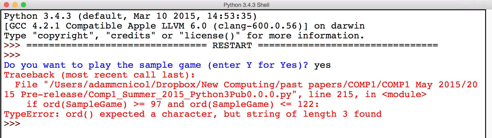

The function `GetTypeOfGame()` is responsible for getting this message from the user.

Rather than giving an error message the program should provide suitable feedback to the user and allow them to try again:

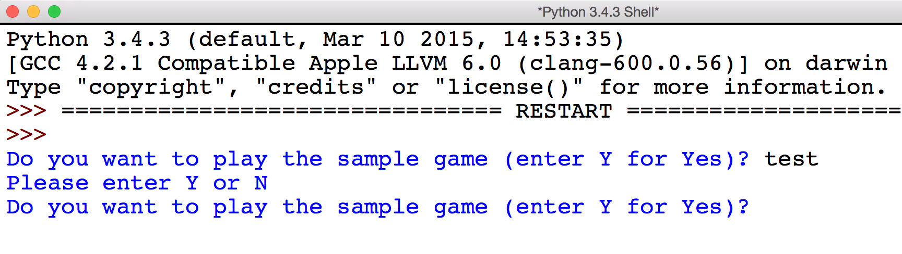

Now attempt the **exercises** below.

---
1. **Improve** this function so that all **valid** input (`y`,`Y`,`Yes`,`n`,`N`,`No` etc.) is accepted.
2. **Ensure** that this function is being used in the main program to get value for `SampleGame`.

---

##Task 2 - Move Validation
To make a move in this game you must provide the program with the following:

- Starting File
- Starting Rank
- Finishing File
- Finishing Rank

This is done by providing the program with responses in the form of co-ordinates for the starting and ending board positions:

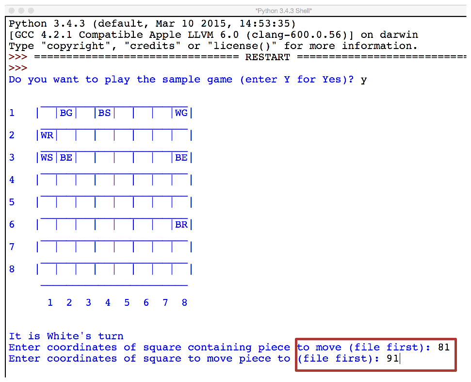

Attempt the **exercises** below.

---
1. **Explain** what happens when a piece is moved off the **right-hand** edge of the board.
2. **Explain** what happens when a piece is move off the **left-hand** edge of the board.
3. **Explain** what happens when a piece is moved off the **top** edge of the board.
4. **Explain** what happens when a piece is moved off the **bottom** edge of the board.
5. **Explain** any differences you encountered whilst attempting the above questions (1-4).
6. **Identify** the function responsible for validating whether a move is acceptable or not.
7. **Improve** the function identified in question 6 so that an appropriate message is displayed if the move is not valid. The user should then be prompted to reenter the co-ordinates of the move.

    This message might look like the following:

    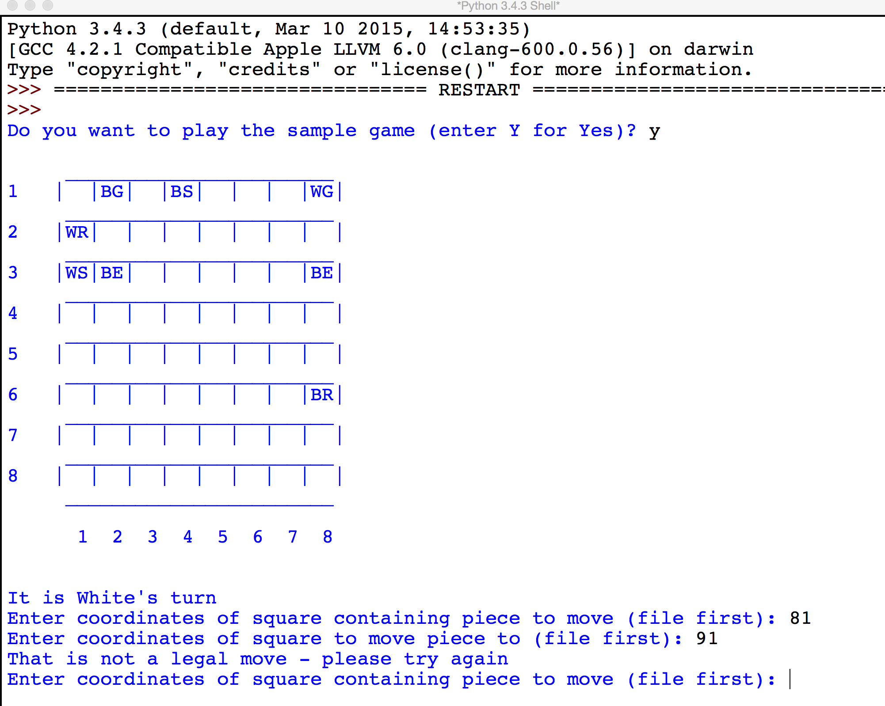

---

##Task 3 - Rank and File Validation
The program expects that you will enter a **two digit** value for the co-ordinates. Whilst it will correctly reject moves containing single digit values it does not do so immediately - this wastes time, as you must reenter the entire move.

In addition, if you attempt to enter an **erroneous** value the program currently crashes with a `ValueError`:

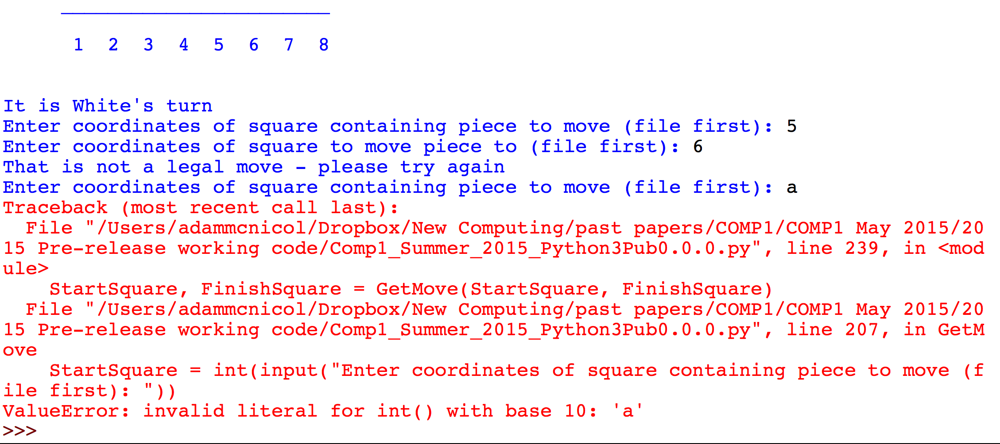

Attempt the **exercises** below.

---
1. **Identify** the function responsible for getting the move from the user.
2. **Improve** this function so that the start and end positions are validated separately. This means that an appropriate error message should be displayed as soon as invalid data has been entered:

    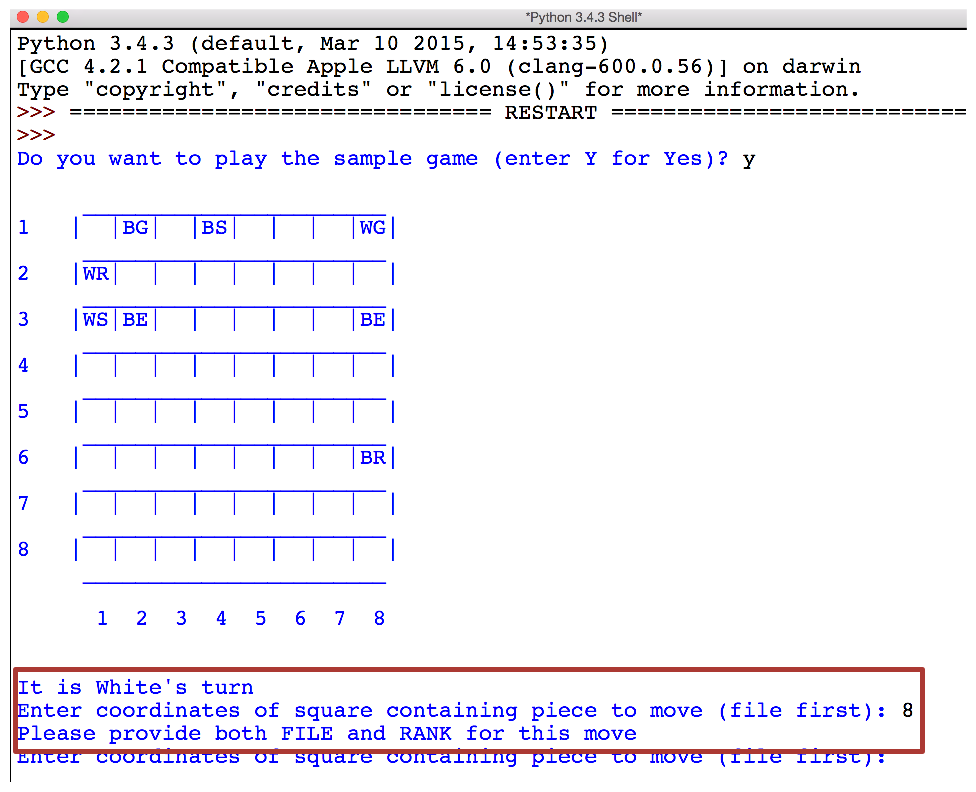

---

##Task 4 - Move Confirmation
It is often the case in games such as **Capture the Sarrum** and **Chess** that you will have to think hard about your next move. Whilst playing a physical version of the game, the move is not confirmed **until** you let go of the piece. This is not possible in the current programmed version.

To approximate this functionality the program should ask you to confirm the move before going ahead and making it:

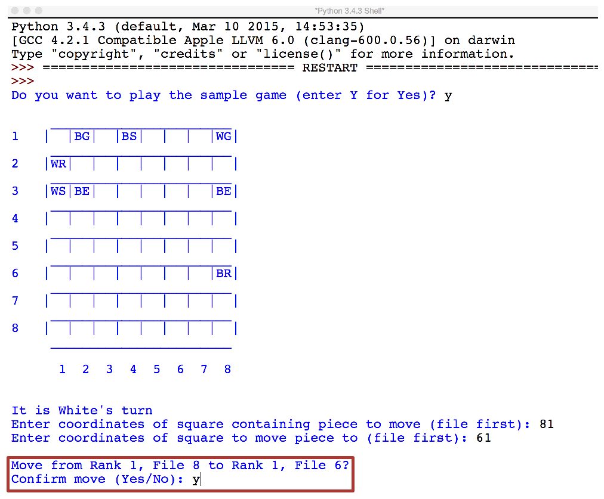

If you do not confirm then the program should ask you to select another move.

Attempt the **exercises** below.

---
1. **Create** a new function called `ConfirmMove()` that will take `StartSquare` and `FinishSquare` as **parameters** and **return** whether the move was confirmed or not.
2. **Amend** the main program to confirm the move before it is made.

---

##Task 5 - Game Piece Removal Confirmation
Currently the game provides no feedback as to what has just happened. This is true even when the previous move has resulted in a game piece being removed from the game. 

After the move has been confirmed the game should present the user with a message similar to the one below:

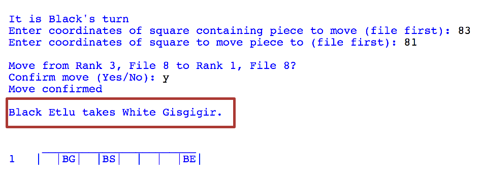

Attempt the **exercises** below.

---
1. **Describe** what is returned by the game when a position on the board containing a piece is selected e.g. `Board[4][3]` (if there where a piece in that position).
2. **Create** a new function called `GetPieceName()` that takes the value identified in question 1 and returns the full name of **both** the **colour** and **type** of piece.
3. **Identify** the function responsible for moving the pieces on the board.
4. **Improve** the function identified in question 3 to make use of the new function `GetPieceName()` to present the user with a message similar to the one in the screenshot above.

---

##Task 6 - Redum Promotion Confirmation
When the **Redum** piece reaches the opposing side of the board it is promoted to a **Marzaz Pani**. Currently the game does change the piece but it does not confirm that this has occurred.

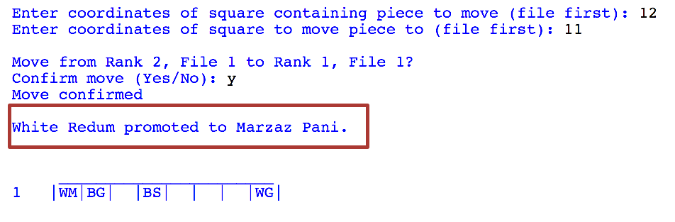

It would be better if the game displayed a message similar to the one above.

Attempt the **exercises** below.

---
1. **Identify** the function where the **Redum** is promoted to the **marzaz Pani**.
2. **Improve** the function identified in question one so that an appropriate message is displayed when the Redum piece is promoted.

---

##Task 7 - Board Layout
The presentation of the game board is currently not very good. It would be helpful if it provided reminders that the rank is vertical and the file horizontal, for instance:

Attempt the **exercises** below.

---
1. **Identify** the function where the board is generated to be displayed.
2. **Amend** this function so that the board closely resembles the one in the screenshot above.

---

##Task 8 - Variable roles
Section B of the COMP1 exam focuses on your understanding of the program source code. Often the questions will focus on the **role of variables** in the program. There are several different roles that a variable can have: they are described on **page 66** of the AS textbook.

**Answer** the following questions.

---
1. Describe each variable role in **your own words**.
2. Give an example of variable from the program code for each variable role (if possible).

---

##Task 9 - Functions and parameters
When **binding** arguments to parameters they are passed into the function either *by value* or *by reference*. In some programming languages you can specify which method to use but in Python this is done automatically for you. Some values are passed by value and others by reference - it depends on the value's **data type**.

|**Data Type**|**Passing Mechanism**|
|-------------|---------------------|
|Integer|by value|
|Float|by value|
|String|by value|
|Boolean|by value|
|List|by reference|
|Record|by reference|

The AS textbook has a good section on passing by value and passing by reference on **pages 63 to 65**.

**Answer** the following questions.

---
1. Describe the difference between passing by value and passing by reference in **your own words**.
2. For each function in the program identify the mechanism using to pass each parameter. **Note**: this task will take a while but it will improve your understanding of the program and by useful for the exam.

---

##Task 10 - Sarrum in Check Validation
A Game of Capture the Sarrum ends when the Sarrum piece is captured. This is similar to the way that a game of chess ends once the King is in **check mate**.

Before this happens the King is generally placed in **check** by an opposing piece. Being in check means that the King must be moved or defended otherwise it would be captured next turn. When this happens the player must verbally indicate that the King is now in check.

Currently the game does not indicate to the player that their Sarrum has been placed in check by the other player. It would be good if a message was displayed indicating that the last move resulted in the Sarrum being in check:

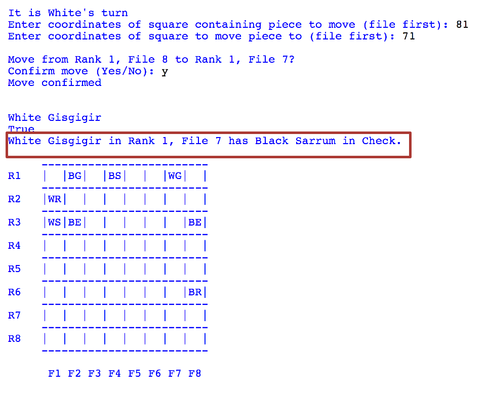

If the player then attempts to make a move that does not resolve the check then the following message should be displayed:

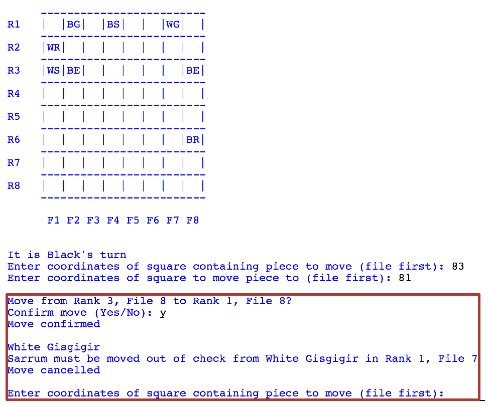

If the move entered does get the Sarrum out of check then the game should proceed as normal.

**This task is very challenging and it is very unlikely that you will be asked to do complete a similar task in the exam. Therefore if you are not confident about attempting it you can safely skip this task. However, it is an excellent challenge and if you can solve it then you are showing that you have a high level of skill in both Python and problem solving in general.**

Attempt the **exercises** below.

---
1. **Create** a new function called `GetValidBoardPosition()` that will take both a `Rank` and a `File` as parameters. The function will check to make sure that the rank and file provided produce a valid board position and then **return** this.
2. **Create** functions for each of the following that take the four **parameters**: `Board`, `FinishRank`, `FinishFile` and `WhoseTurn`:
    - `CheckWithRedum()`
    - `CheckWithNabu()`
    - `CheckWithMarzazPani()`
    - `CheckWithEtlu()`
    - `CheckWithGisgigir()`
    
    Each of these functions will **return** whether the piece has the opposing Sarrum in check or not.
3. **Create** a function called `CheckSarrumInCheck()`, which takes four **parameters**: `Board`, `FinishRank`, `FinishFile` and `WhoseTurn`. This function will **return** the following:
    - Whether the opposing Sarrum is in check
    - The piece code (colour and name) of the piece that is causing the check
    - The location of the piece causing the check (**both** rank and file)
4. **Create** a function called `CheckMessage()` that will take the name and colour of the piece causing the check and its location and output a suitable message, similar to the one in the screenshot above.
5. Finally, **improve** the main program to make use of the functions you have created and provide the Sarrum check validation.

---

##Next
This task sheet has focused on **validation**, the next set of tasks will involve making improvements to the actual game.

