#Task Sheet 2 - Game Improvements

##Introduction
This series of tasks focuses on improving the user interface and functionality of the Capture the Sarrum game.

##Task 11 - Main Menu
When the user first loads the program they are presented with the following option:

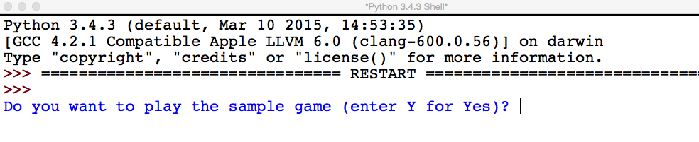

This is fine at the moment as the game has limited functionality. If however, the program is to be improved so that it has additional options available it would be better if a **menu** is presented instead:

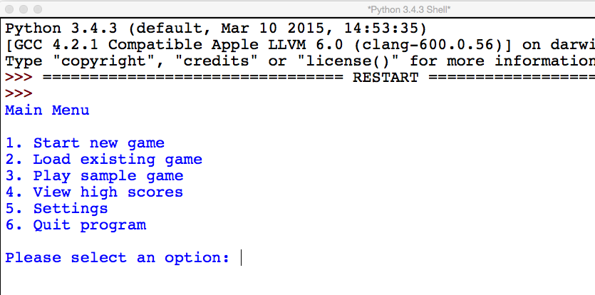

To do this the following additional functions are required:

- `display_menu()`
- `get_menu_selection()`
- `make_selection()`
- `play_game()`

Attempt the **exercises** below.

---
1. Attempt to **explain** the purpose of each of the new functions listed above and indicate any **parameters** or **return** values that each of them will require.
2. **Write** the function `display_menu()` and add it to the existing program.
3. **Write** the function `get_menu_selection()` including any **validation** that is necessary and add it to the existing program.
4. **Write** the function `make_selection()` and add it to the existing program.
5. **Write** the function `play_game()`, **refactoring** the existing program to make use of it.

---

##Task 12 - In-game Menu
At the moment once a game has been started there is no way to interrupt it aside from quitting the program and starting it again. Clearly this is unsatisfactory. There are many instances where being able to interrupt the game would be useful, for example:

- Saving the game
- Quiting the game

An option to recognise a **rogue value** could be added so that an in-game menu could be displayed:

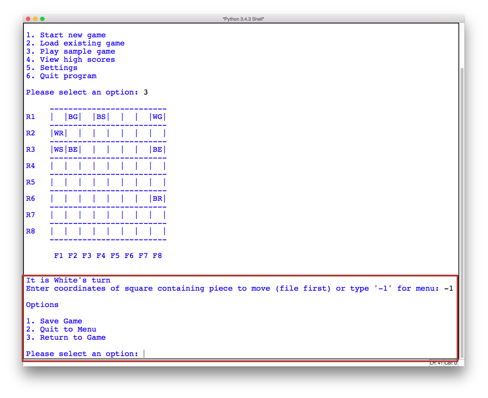

Attempt the **exercises** below.

---
1. **Identify** the functions that will require modification to make it possible for an in-game menu to be presented.
2. **Write** the functions necessary to **display** the menu and get an **option** from the user and then add them to the existing program.
3. **Modify** the program so that the it can make use of the new functions you have written to present the in-game menu.

---

##Task 13 - Surrendering
One option that is common in games like Chess is the ability to surrender or forfeit a game. This may be necessary as the player could be in position where there is no way to win but it may require several more moves to actually get to that game state or simply that the player has to go and has no more time to play!

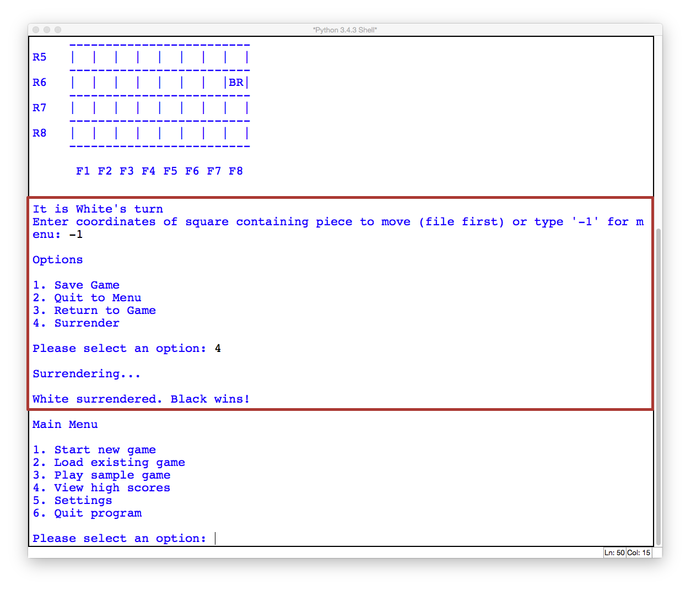

In the above screenshot the option to surrender has been added to the **in-game** menu and the message displayed to show the winner is appropriate to the situation.

Attempt the **exercises** below.

---
1. **Identify** the functions that will require modification to make it possible to surrender during the game. **Explain** why each function will require modification.
2. **Modify** the functions identified above so that surrendering is possible.

---

##Task 14 - Refactoring
The function `InitialiseBoard()` contains the following code:

```python3
def InitialiseBoard(Board, SampleGame):
  if SampleGame == "Y":
    for RankNo in range(1, BOARDDIMENSION + 1):
      for FileNo in range(1, BOARDDIMENSION + 1):
        Board[RankNo][FileNo] = "  "
    Board[1][2] = "BG"
    Board[1][4] = "BS"
    Board[1][8] = "WG"
    Board[2][1] = "WR"
    Board[3][1] = "WS"
    Board[3][2] = "BE"
    Board[3][8] = "BE"
    Board[6][8] = "BR"
  else:
    for RankNo in range(1, BOARDDIMENSION + 1):
      for FileNo in range(1, BOARDDIMENSION + 1):
        if RankNo == 2:
          Board[RankNo][FileNo] = "BR"
        elif RankNo == 7:
          Board[RankNo][FileNo] = "WR"
        elif RankNo == 1 or RankNo == 8:
          if RankNo == 1:
            Board[RankNo][FileNo] = "B"
          if RankNo == 8:
            Board[RankNo][FileNo] = "W"
          if FileNo == 1 or FileNo == 8:
            Board[RankNo][FileNo] = Board[RankNo][FileNo] + "G"
          elif FileNo == 2 or FileNo == 7:
            Board[RankNo][FileNo] = Board[RankNo][FileNo] + "E"
          elif FileNo == 3 or FileNo == 6:
            Board[RankNo][FileNo] = Board[RankNo][FileNo] + "N"
          elif FileNo == 4:
            Board[RankNo][FileNo] = Board[RankNo][FileNo] + "M"
          elif FileNo == 5:
            Board[RankNo][FileNo] = Board[RankNo][FileNo] + "S"
        else:
          Board[RankNo][FileNo] = "  " 
```

It could be **refactored** so that there are three functions instead:

- `InitialiseBoard()`
- `InitialiseNewBoard()`
- `InitialiseSampleBoard()`

Attempt the **exercises** below.

---
1. **Explain** what is meant by the term refactoring and why it is sometimes useful to refactor sections of code.
2. **Refactor** the `InitialiseBoard()` function so that there are the three functions identified in the list above.

---

##Task 15 - Variable Roles
Section B of the COMP1 exam focuses on your understanding of the program source code. Often the questions will focus on the **role of variables** in the program. There are several different roles that a variable can have: they are described on **page 66** of the AS textbook.

**Answer** the following questions.

---
1. Describe each variable role in **your own words**.
2. Give an example of variable from the program code for each variable role.

---

##Task 16 - Improve Marzaz Pani
Currently the **Marzaz Pani** piece can move in the following ways:

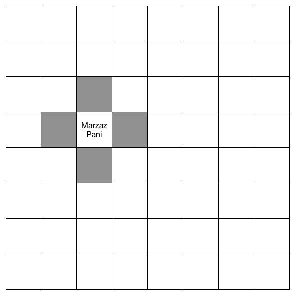

It can move **one space** horizontally or vertically in any direction. An improvement would be to make it so that it could also move **diagonally**:

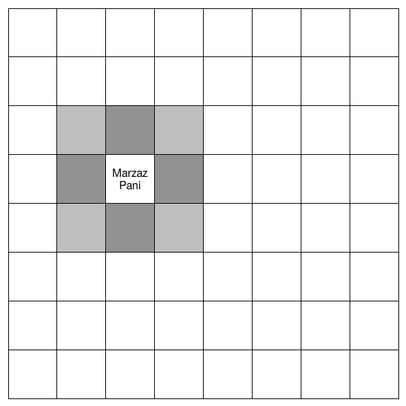

Attempt the **exercise** below.

---
1. Make any necessary **modifications**so that the Marzaz Pani piece can move one space diagonally in any direction, in addition to its current movement range.

---

##Task 17 - Improve Nabu
Currently the **Nabu** piece can move in the following ways:


It can move **one space** diagonally in any direction. An improvement would be to make it so that it could move **any number of spaces** diagonally (so that it was like a Bishop in Chess):

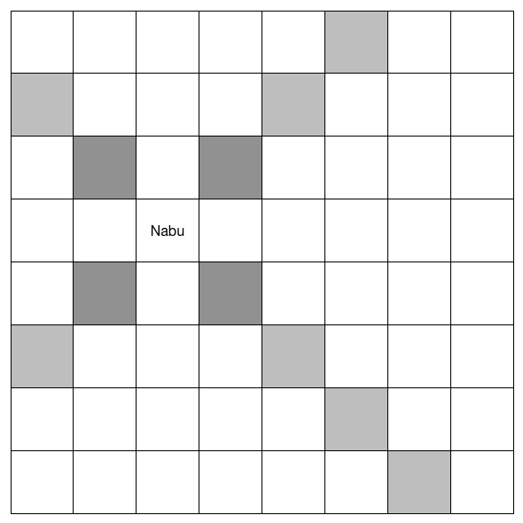

Attempt the **exercise** below.

---
1. Make any necessary **modifications** so that the Nabu piece can move any number of spaces diagonally in any direction.

---

##Task 18 - Improve Etlu
Currently the **Etlu** piece can move in the following ways:

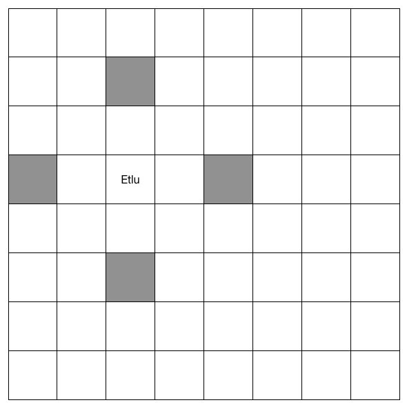

It can move **exactly two spaces** in a horizontal or vertical direction and **jump** over pieces that are in its way. An improvement would be to make it so that its movement was like that of a **Knight** in Chess:

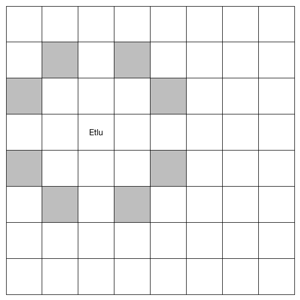

Attempt the **exercise** below.

---
1. Make any necessary **modifications** so that the Nabu piece can move like a Knight in Chess.

---

##Task 19 - Improve Redum
The **Redum** piece in Capture the Sarrum is similar to the **Pawn** in Chess. Once difference is that a pawn can move **upto** two spaces on its first move. Currently the **Redum** can only move one:

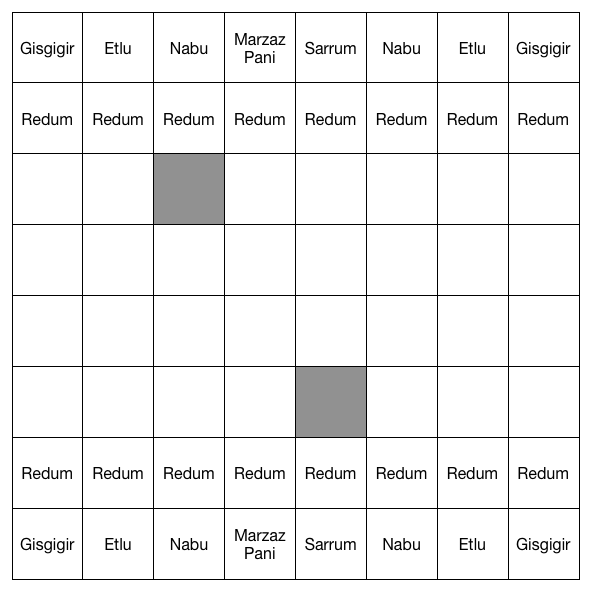

Each **Redum** piece should have the option of moving either one or two spaces on its opening move **only**:

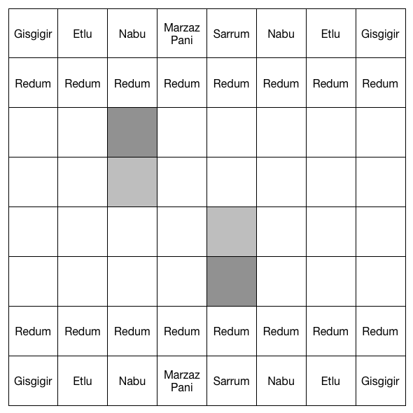

Attempt the **exercises** below.

---
1. Make any necessary **modifications** so that the Redum piece can move up to two spaces on its opening move.

---

##Task 20 - Functions and Parameters
When **binding** arguments to parameters they are passed into the function either *by value* or *by reference*. In some programming languages you can specify which method to use but in Python this is done automatically for you. Some values are passed by value and others by reference - it depends on the value's **data type**.

|**Data Type**|**Passing Mechanism**|
|-------------|---------------------|
|Integer|by value|
|Float|by value|
|String|by value|
|Boolean|by value|
|List|by reference|
|Record|by reference|

The AS textbook has a good section on passing by value and passing by reference on **pages 63 to 65**.

**Answer** the following questions.

---
1. Describe the difference between passing by value and passing by reference in **your own words**.
2. For each function in the program identify the mechanism using to pass each parameter. **Note**: this task will take a while but it will improve your understanding of the program and by useful for the exam.

---

##Next
This task sheet has focused on improving the user interface and functionality of the game. The next set of tasks will build on this to provide a more rounded gaming experience.