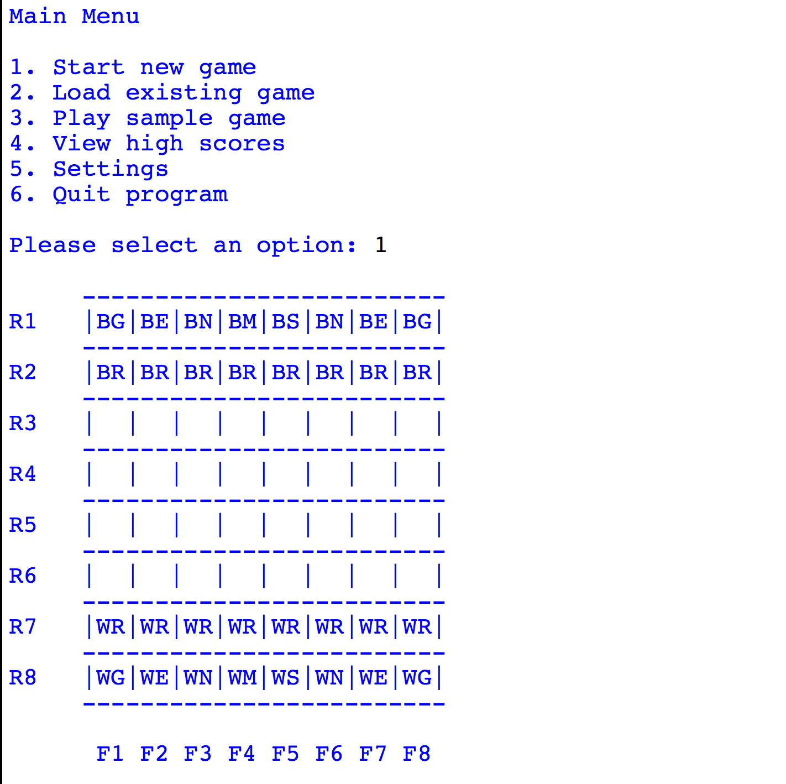
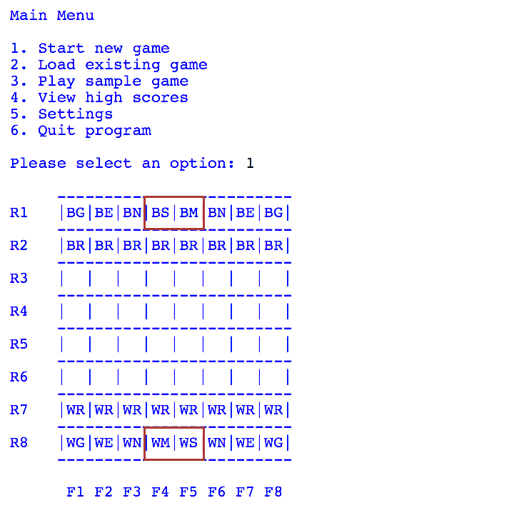
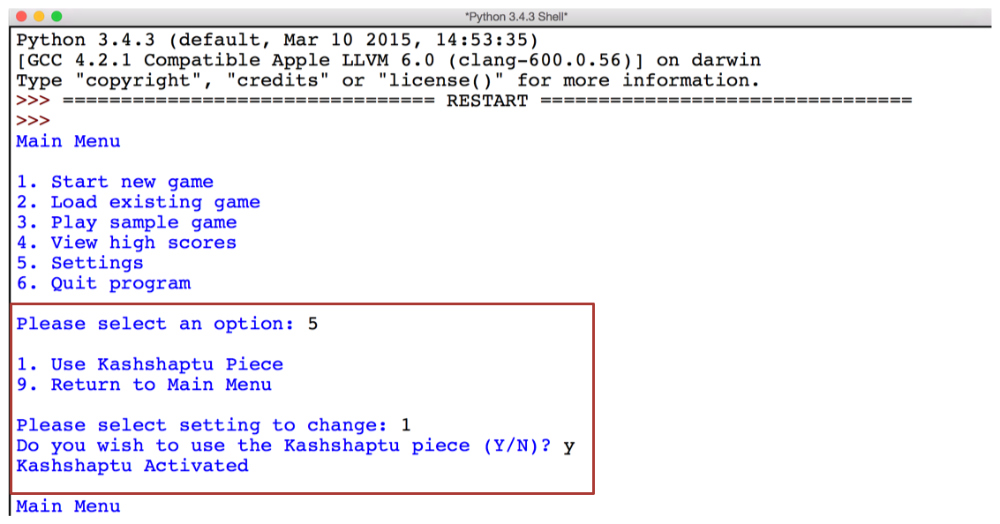
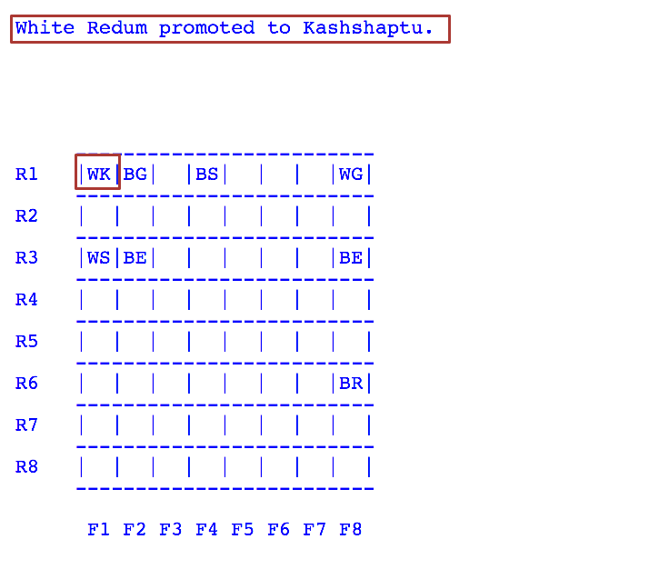
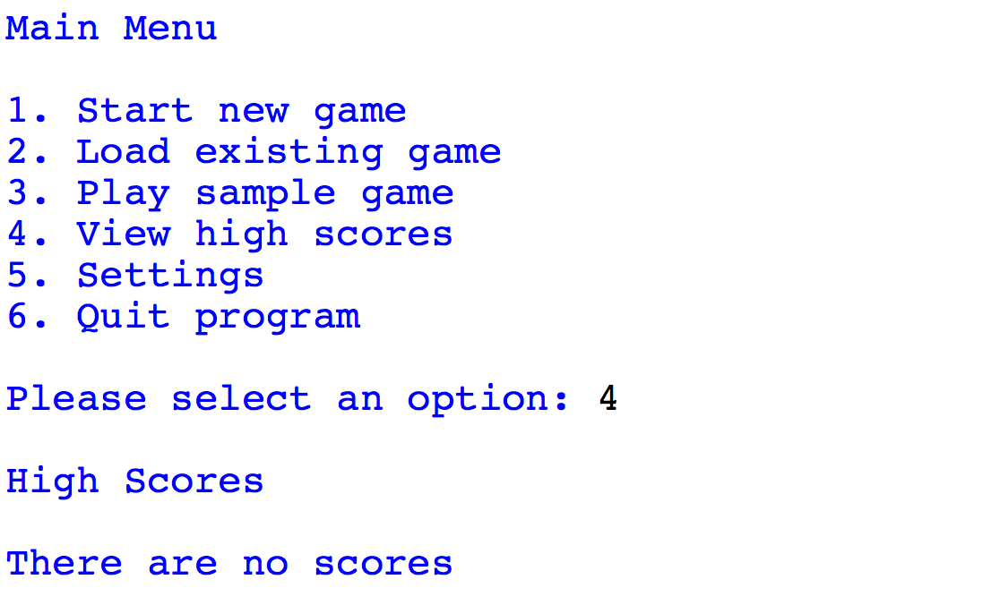
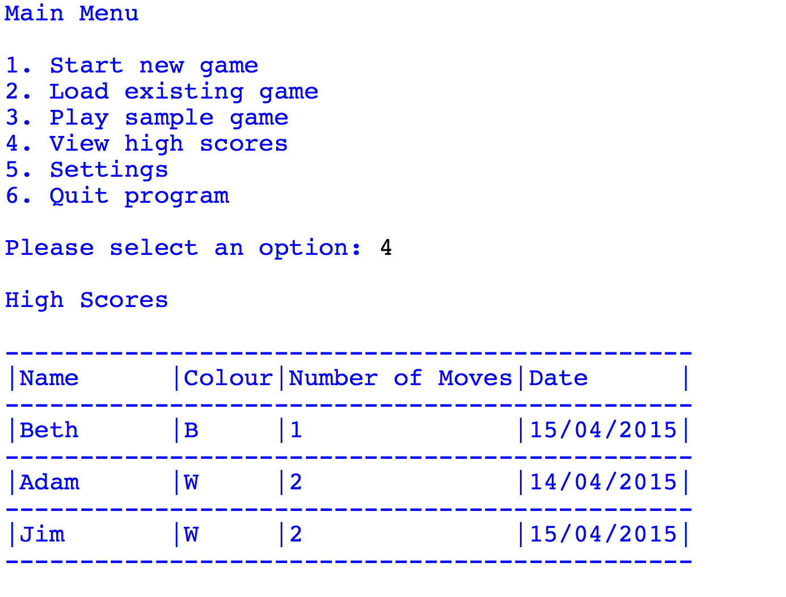
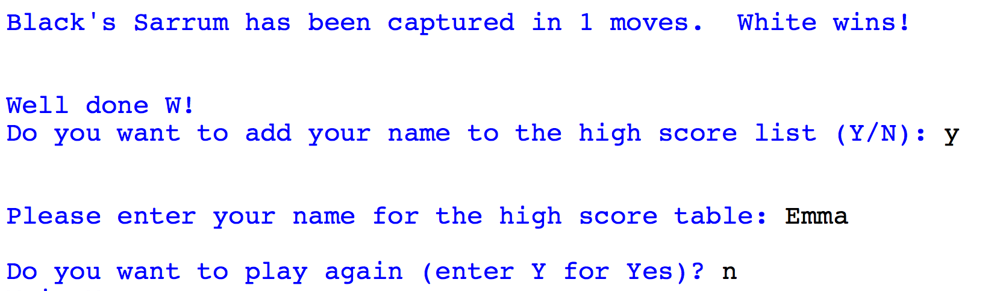
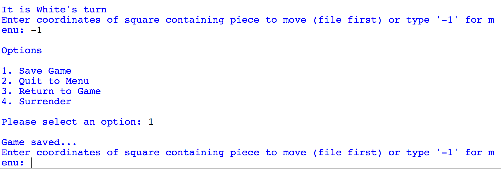
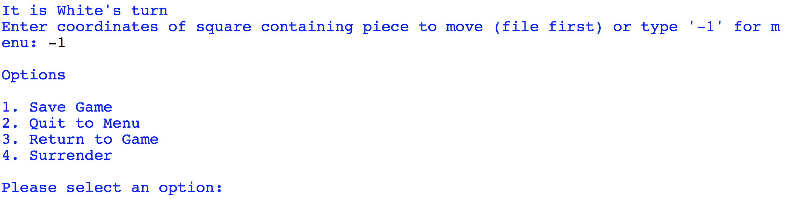

#Task Sheet 3 - Further Game Improvements

forked

##Introduction
This series of tasks focuses on adding additional features to the Capture the Sarrum game.

##Task 21 - Sarrum and Marzaz Pani initial positions
When a new game is started, the positioning of the pieces on the board is **symmetrical**:

In the game of Chess, the King and Queen pieces are positioned differently. The King of one side faces the Queen of the opposing side. If Capture the Sarrum was changed so that the Sarrum and Marzaz Pani followed the Chess positioning rules the board would look as follows:

Attempt the **exercises** below.

---
1. **Identify** the function responsible for positioning the Sarrum and Marzaz Pani pieces during the setup of the board.
>The function responsible is `InitializeNewBoard(Board)`

2. **Make** the neccessary changes to this function so that the setup positioning reflects the screenshot above.
 

---

##Task 22 - Kashshaptu
In the preliminary material there is mention of an additional piece called a **Kashshaptu** or **Witch**. The preliminary material mentions that it is not known how this piece is supposed to work in the game.

One interpretation of the **Kashshaptu** is that it is a special piece that only enters play once a **Redum** has been **promoted** i.e. the Redum is promoted to a Kashshaptu instead of a Marzaz Pani.

The Kashshaptu piece is very powerful and is capable of moving and taking pieces as if it were any of the other pieces **except** the Sarrum itself.

Because this piece is so powerful its inclusion in the game is always **optional**.

To add this to the game a settings **sub-menu** is required:

This menu will provide the option to turn the piece on and off as the user wishes. It should always be **off** when the program loads but if the setting is changed to **on** then all games will use the Kashshaptu piece until either the option is turned off again or the program exits.

Once in game, if a Redum is promoted an appropriate message should be displayed and the code **WK** or **BK** should be used to represent the Kashshaptu:

Attempt the **exercises** below.

---
1. **Add** the necessary functions to the program so that the settings menu shown above is added to the game. **Ensure** that the value indicating whether the Kashshaptu is on or off is easily accessible by all the other functions in the program.
2. **Identify** the function responsible for promoting the Redum piece.
3. **Make** any necessary changes to the function identified in question 2 so that the Redum can be promoted to a Kashshaptu **if** the option to use this piece has been turned on.
4. **Ensure** that the correct piece name is displayed when the Redum is promoted and make any improvements required to do so.
5. The Kashshaptu piece can move as if it were any of the other pieces, except the Sarrum. **Write** a function that will check to make sure the Kashshaptu move is legal. In addition, make any other improvements necessary to ensure that a Kashshaptu move is recognised correctly.
6. If you completed **Question 10** in **Task Sheet 1** you might want to ensure that the game detects when a Kashshaptu has been used to place a Sarrum in check. This exercise is **optional**.
7. Write a **test plan** to ensure that the Kashshaptu functionality works as intended.
---

##Task 23 - Hall of Fame
Many games have the ability to view high scores, so you can see who in your group is the best at the game. Whilst there is no real scoring in Capture the Sarrum it would be possible to track the **number of moves** the winner takes to capture the Sarrum. This could then be displayed in a table, accessible from the main menu:

**Notice** that either a message saying that there are no scores or a table is displayed (depending on what is appropriate).

Attempt the **exercises** below.

---
1. **Write** a new function called `display_high_scores()` that takes a list of scores as an argument and then either presents an appropriate formatted table of the scores (similar to the one given above) or a message saying that there are currently no scores.
---

In order to add their name and score to the table the winner of each game should be prompted as shown:

Attempt the **exercises** below.

---
2. **Make** the changes necessary to track the number of moves that have been played in the game.
3. **Amend** the function responsible for displaying the winning message so that it shows the number of moves taken (similar to the screenshot above).
4. **Add** the function(s) necessary to prompt the user to add their score to the high score table. **Ensure** that you include the following when storing the score:

    - Player name
    - Colour played
    - Number of moves taken
    - The current date
---

##Task 24 - Save Hall of Fame
In the last task you added the ability to track high scores but they do not **presist** between runs of the program i.e. the scores are lost when the program exits.

The score table should be saved to a **file** when the program exits.

Attempt the **exercises** below.

---
1. **Write** a new function called `save_high_scores()` that takes `scores` as an argument and then saves then to either a binary or text file.
2. **Modify** the program so that the `save_high_scores()` function is called before the program exits.
---

##Task 25 - Load Hall of Fame
Now that the program stores the scores into a file it should be possible to load these scores when the program first loads.

Attempt the **exercises** below.

---
1. **Write** a new function called `load_high_scores()` that loads the scores from a file and then returns the list of scores. **Ensure** that your function can deal with the situation where no file is found.
2. **Modify** the program so that the `load_high_scores()` function is called when the program launches.
---

##Task 26 - Save and Load Board Games
Sometimes it is not possible to finish a game that you have started, perhaps you get called away for dinner or you are going out to meet friends. In these situations it would be handy to be able to save the game and continue it at a later date.

You have already added an **in-game menu** that enables you to select a save option from within the game:

In addition there is an option on the main menu to load a game.

Attempt the **exercises** below.

---
1. **Identify** the pieces of data that will need to be saved to be able to resume a game from where you left off:

    |Number|Data Description|
    |------|----------------|
    |1| |
    |2| |
    |3| |
    |4| |
    |5| |
    |6| |
    |7| |

2. **Write** a new function called `save_board_state()` that takes the argument `board_state` and then saves this to either a binary or text file.
3. **Make** any necessary changes to the program so that it is possible to call the `save_board_state()` function from the in-game menu.
4. **Write** a new function called `load_board_state()` that loads the board state from a file and returns it to the program.
5. **Make** any necessary changes to the program so that it is possible to call the `load_board_state()` function from the main menu and then resume the saved game.
---

##Task 27 - Resume Current Game
Occasionally it may be necessary to use the **in-game** menu option **Quit to Menu**:

This may be because you want to check some high scores or something similar. In this case it should be possible to **resume** the game you were playing rather than having to start a new one or explicitly save and load the game.

If a game is in progress the program should detected this when selecting the following options from the main menu:

- Start new game
- Play sample game

In the above screenshot the program prompts you to decide whether you want to continue the previous game or not.

Attempt the **exercises** below.

---
1. **Make** any necessary changes to the game so that the state of the game is saved when quitting to the main menu.
2. **Make** any necessary changes to the program so that the user has the option of restoring a previously started game when selecting "**Start new game**" or "**Play sample game**" from the main menu.
---

##Task 28 - Sort Hall of Fame
Currently the hall of fame is presented in the order that the entries were added to the list. It would be better if they were **sorted** so that those that won in fewer moves are at the top i.e. ascending order.

Attempt the **exercises** below.

---
1. **Write** a new function called `sort_high_scores()` that will take the list of scores as a parameter and sort them appropriately. You should use the **bubble sort** algorithm to do this.
2. **Make** any necessary changes to the program so that this new function is called before the scores are displayed.
---

##Next
This task sheet has focused on improving the game further. The final task sheet will give some suggestions for further improvements that you can make to the game.

